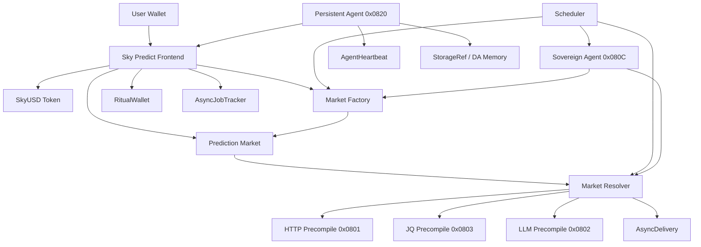
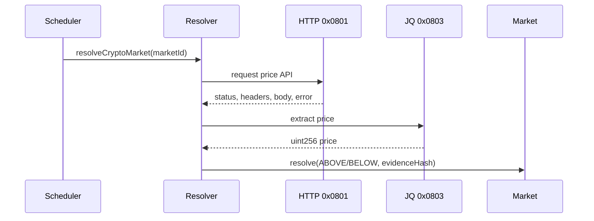

# PLAN UPGRADE — Sky Predict Full Ritual-Native Architecture

> Purpose: this document is the technical foundation for upgrading Sky Predict from the current testnet prediction market stack into a full Ritual-native autonomous prediction market protocol.
>
> Target: make Sky Predict genuinely match the whitepaper narrative: Ritual Chain first, TEE-backed data workflows, native precompiles, scheduled execution, autonomous agents, and AI-assisted market operations.

---

## 1. Executive Summary

Sky Predict currently works as a prediction market application with smart contracts, a SkyUSD market token, frontend wallet interactions, and an off-chain automation script for market creation and resolution.

The full upgrade should replace or reduce centralized backend responsibilities by using Ritual Chain primitives:

- **HTTP precompile `0x0801`** for TEE-attested real-world data retrieval.
- **JQ precompile `0x0803`** for typed JSON extraction from HTTP responses.
- **LLM precompile `0x0802`** for AI-assisted research, explanations, market summaries, and settlement commentary.
- **Scheduler system contract** for recurring market creation, expiry checks, and settlement triggers.
- **AsyncJobTracker** for async lifecycle monitoring.
- **AsyncDelivery** for two-phase callback delivery.
- **RitualWallet** for precompile and agent execution funding.
- **Sovereign Agent precompile `0x080C`** for scheduled autonomous market operators.
- **Persistent Agent precompile `0x0820`** for long-running market intelligence agents.
- **DKMS / secrets / ECIES** for encrypted API credentials, private strategy memory, and secure agent state.
- **AgentHeartbeat** for liveness tracking and revival of persistent agents.

The upgrade should be done gradually, not in one risky rewrite. The recommended path is:

1. Stabilize current contracts and frontend.
2. Introduce Ritual precompile consumer utilities.
3. Add Ritual-native resolver contracts for crypto markets.
4. Add Ritual-native resolver contracts for sports markets.
5. Move automation from backend cron/PM2 into Scheduler-driven contracts.
6. Add async lifecycle tracking in frontend.
7. Add LLM-powered market explanation and settlement evidence.
8. Add Sovereign Agent market operator.
9. Add Persistent Agent research network.
10. Harden, audit, and remove obsolete centralized automation paths.

---

## 2. Current Architecture Baseline

### 2.1 Existing Core Components

Current project components that must be preserved or migrated:

| Component | Current Role | Upgrade Direction |
|---|---|---|
| `SkyUSDT.sol` / SkyUSD token | Testnet market token and faucet | Keep as participation unit, harden token/faucet flows if needed |
| `MarketFactory` | Creates markets | Extend or replace with Ritual-aware factory |
| `PredictionMarket` | Holds pools, tracks bets, resolves outcomes | Keep core accounting, add resolver hooks |
| `scripts/auto-market.ts` | Off-chain market creation and resolution | Gradually replace with Scheduler + agents |
| Frontend write logic | Approval, bet, claim, faucet | Keep, add async job and RitualWallet UX |
| Documentation/whitepaper | Branding | Keep aligned with final architecture |

### 2.2 Current Limitations To Remove

The current system still depends on backend automation for tasks that Ritual can eventually own:

- Market creation schedule is off-chain.
- Data fetching is off-chain.
- Settlement trigger is off-chain.
- Resolution evidence is not TEE-attested.
- AI/agent layer is not yet part of protocol execution.
- Frontend does not yet show Ritual async job lifecycle.
- No RitualWallet deposit/lock UX exists yet.
- No callback-based async settlement contract exists yet.

---

## 3. Target Architecture

### 3.1 High-Level Architecture



### 3.2 Contract Layers

The upgraded protocol should use these layers:

1. **Token Layer**
   - SkyUSD token.
   - Faucet or distribution contract.
   - Optional treasury controls.

2. **Market Layer**
   - `PredictionMarket` or upgraded `RitualPredictionMarket`.
   - Handles pools, positions, deadlines, outcome state, and payouts.

3. **Factory Layer**
   - Creates standardized markets.
   - Registers markets by category.
   - Stores resolver config.
   - Emits rich market metadata events.

4. **Resolver Layer**
   - Contains category-specific settlement logic.
   - Uses HTTP/JQ/LLM precompiles.
   - Validates data freshness, status codes, and parsed output.
   - Calls market settlement function.

5. **Scheduler Layer**
   - Creates markets periodically.
   - Schedules expiry checks.
   - Schedules settlement triggers.
   - Wakes agent operators.

6. **Agent Layer**
   - Sovereign agents for scheduled decisions.
   - Persistent agents for continuous research.
   - Agent state persistence through StorageRef.
   - Heartbeat and revival through Ritual agent primitives.

7. **Frontend Layer**
   - Normal wallet UX.
   - RitualWallet funding UX.
   - Async job lifecycle display.
   - Settlement evidence panel.
   - AI explanation panel.

---

## 4. Ritual Chain Technical Concepts To Implement

### 4.1 TEE-EOVMT Execution Model

Ritual uses a mixed execution model:

- **Replicated deterministic EVM execution** for normal Solidity state changes.
- **Delegated TEE execution** for non-deterministic workloads such as HTTP, LLM, long-running agents, image generation, and external API calls.

For Sky Predict:

- Bets, pools, balances, and claims remain deterministic EVM state.
- Price feeds, sports results, market research, and AI summaries move to TEE delegated execution.

### 4.2 Async Execution Models

Ritual has several result paths:

| Execution Type | Use Case In Sky Predict |
|---|---|
| Synchronous | JQ parsing, some deterministic extraction |
| Short-running async / SPC | HTTP price fetch, LLM summary if quick enough |
| Long-running two-phase | Sovereign agent execution, persistent agent spawn, long market research |

Important constraints:

- One async precompile call per transaction.
- Frontend must serialize pending jobs per wallet where sender-lock applies.
- Async callbacks must verify `msg.sender == AsyncDelivery`.
- Callback functions must protect against stale state changes.
- Settlement must re-check market status at callback time.

### 4.3 System Contracts To Integrate

| Contract | Address | Usage |
|---|---:|---|
| RitualWallet | `0x532F0dF0896F353d8C3DD8cc134e8129DA2a3948` | Prepay/lock funds for precompile and agent jobs |
| AsyncJobTracker | `0xC069FFCa0389f44eCA2C626e55491b0ab045AEF5` | Track async job lifecycle |
| TEEServiceRegistry | `0x9644e8562cE0Fe12b4deeC4163c064A8862Bf47F` | Select registered TEE executors |
| Scheduler | `0x56e776BAE2DD60664b69Bd5F865F1180ffB7D58B` | Deferred market and agent execution |
| SecretsAccessControl | `0xf9BF1BC8A3e79B9EBeD0fa2Db70D0513fecE32FD` | Secure secret access |
| AsyncDelivery | `0x5A16214fF555848411544b005f7Ac063742f39F6` | Two-phase async callback delivery |
| AgentHeartbeat | `0xEF505E801f1Db392B5289690E2ffc20e840A3aCa` | Persistent agent liveness |
| ModelPricingRegistry | `0x7A85F48b971ceBb75491b61abe279728F4c4384f` | Model price/availability lookup |

---

## 5. Smart Contract Upgrade Plan

### Phase 1 — Add Ritual Constants And Interfaces

Create a dedicated library folder in contracts:

```text
contracts/contracts/ritual/
  RitualAddresses.sol
  IAsyncDelivery.sol
  IAsyncJobTracker.sol
  IRitualWallet.sol
  IScheduler.sol
  ITEEServiceRegistry.sol
  IPrecompileConsumer.sol
  PrecompileConsumer.sol
```

#### `RitualAddresses.sol`

Should contain:

- `HTTP_PRECOMPILE = 0x0000000000000000000000000000000000000801`
- `LLM_PRECOMPILE = 0x0000000000000000000000000000000000000802`
- `JQ_PRECOMPILE = 0x0000000000000000000000000000000000000803`
- `LONG_HTTP_PRECOMPILE = 0x0000000000000000000000000000000000000805`
- `SOVEREIGN_AGENT_PRECOMPILE = 0x000000000000000000000000000000000000080C`
- `DKMS_PRECOMPILE = 0x000000000000000000000000000000000000081B`
- `PERSISTENT_AGENT_PRECOMPILE = 0x0000000000000000000000000000000000000820`
- system contract addresses listed above.

#### `PrecompileConsumer.sol`

Responsibilities:

- Internal `_executePrecompile(address precompile, bytes calldata input)` helper.
- Revert bubbling.
- Result validation.
- Optional events:
  - `PrecompileRequested`
  - `PrecompileExecuted`
  - `PrecompileFailed`

### Phase 2 — Split Market Accounting From Resolution

Current market resolution should be refactored so only an authorized resolver can settle.

Recommended market structure:

```solidity
contract RitualPredictionMarket {
    enum Status { Open, Locked, Resolving, Resolved, Cancelled }
    enum Outcome { None, OptionA, OptionB, Draw }

    address public factory;
    address public resolver;
    Status public status;
    Outcome public winningOutcome;

    function bet(uint8 outcome, uint256 amount) external;
    function lockMarket() external onlyResolverOrScheduler;
    function markResolving(bytes32 jobId) external onlyResolver;
    function resolve(Outcome outcome, bytes32 evidenceHash) external onlyResolver;
    function cancel(bytes32 reasonHash) external onlyResolverOrAdmin;
    function claim() external;
}
```

Key rules:

- Betting allowed only before deadline.
- Resolution cannot happen before settlement time.
- `resolve()` must be callable only by resolver contract.
- Store `evidenceHash` for off-chain evidence display.
- Emit enough events for frontend indexing.

Events:

```solidity
event BetPlaced(address indexed user, uint8 indexed outcome, uint256 amount);
event MarketLocked(uint256 timestamp);
event ResolutionStarted(bytes32 indexed jobId);
event MarketResolved(uint8 indexed outcome, bytes32 evidenceHash);
event MarketCancelled(bytes32 reasonHash);
event Claimed(address indexed user, uint256 amount);
```

### Phase 3 — Add Resolver Config Model

Each market should store resolver configuration:

```solidity
struct ResolverConfig {
    uint8 category;
    string dataUrl;
    string jqQuery;
    uint8 jqOutputType;
    bytes32 rulesHash;
    uint256 settlementTime;
    uint256 staleAfter;
    address executor;
}
```

For crypto market:

- `dataUrl`: API endpoint for pair price.
- `jqQuery`: JSON path for price.
- `threshold`: encoded in market metadata.
- outcome mapping:
  - price >= threshold => ABOVE
  - price < threshold => BELOW

For sports market:

- `dataUrl`: fixture result endpoint.
- `jqQuery`: JSON path for home score, away score, status.
- outcome mapping:
  - home > away => HOME
  - home == away => DRAW
  - away > home => AWAY

### Phase 4 — Crypto Resolver Contract

Create:

```text
contracts/contracts/resolvers/CryptoPriceResolver.sol
```

Responsibilities:

- Request TEE-attested HTTP price data through `0x0801`.
- Parse response using `0x0803`.
- Compare parsed price against market threshold.
- Resolve market.
- Emit full evidence event.

Expected flow:



Validation requirements:

- HTTP status must be 200.
- `errorMessage` must be empty.
- Body must not be empty.
- JQ result length must be greater than zero.
- Parsed price must be within reasonable bounds.
- Market must not already be resolved.
- Current block timestamp must be after settlement time.

Events:

```solidity
event CryptoResolutionEvidence(
    address indexed market,
    string url,
    string jqQuery,
    uint256 price,
    uint256 threshold,
    uint8 outcome,
    bytes32 evidenceHash
);
```

### Phase 5 — Sports Resolver Contract

Create:

```text
contracts/contracts/resolvers/SportsResultResolver.sol
```

Responsibilities:

- Fetch final sports fixture result.
- Parse final status and scores.
- Validate match is final.
- Resolve HOME / DRAW / AWAY.

Validation requirements:

- Match status must be final/finished.
- Scores must be present.
- Fixture ID must match market metadata.
- No settlement before scheduled time.
- If API status is postponed/cancelled, market should be cancelled or extended according to rules.

Events:

```solidity
event SportsResolutionEvidence(
    address indexed market,
    string fixtureId,
    uint256 homeScore,
    uint256 awayScore,
    string status,
    uint8 outcome,
    bytes32 evidenceHash
);
```

### Phase 6 — LLM Explanation Contract

Create:

```text
contracts/contracts/ai/MarketExplanationConsumer.sol
```

Use cases:

- Generate market summary.
- Generate risk warning.
- Generate settlement explanation.
- Generate leaderboard insight.

Important design decision:

Do not let LLM output directly determine winner outcomes. LLM should explain and summarize; deterministic market resolution should come from HTTP/JQ or direct contract reads.

Allowed LLM roles:

- Explain market rules.
- Summarize data used for settlement.
- Generate human-readable evidence text.
- Assist dispute triage.
- Generate market research cards.

Avoid:

- LLM deciding winner without deterministic data.
- LLM having admin authority.
- LLM moving funds directly.

---

## 6. Scheduler Upgrade Plan

### 6.1 Replace `auto-market.ts` Gradually

Do not delete `scripts/auto-market.ts` immediately. Convert it into a temporary fallback while Scheduler integration is tested.

Migration stages:

1. Backend creates markets, backend resolves markets. Current.
2. Backend creates markets, Scheduler resolves markets.
3. Scheduler creates markets, Scheduler resolves markets.
4. Sovereign agent proposes markets, Scheduler creates/resolves markets.
5. Backend only monitors and alerts.
6. Backend removed or kept as emergency operator only.

### 6.2 Market Creation Scheduler

Create:

```text
contracts/contracts/scheduler/MarketScheduler.sol
```

Responsibilities:

- Schedule next crypto market creation.
- Schedule next sports market creation.
- Call factory with templates.
- Re-schedule itself.
- Track call IDs.
- Prevent duplicate market windows.

Suggested functions:

```solidity
function startCryptoSchedule(uint32 initialDelay) external onlyOwner;
function stopCryptoSchedule() external onlyOwner;
function createScheduledCryptoMarket(uint256 executionIndex) external;
function scheduleNextCryptoMarket(uint32 delay) internal returns (uint256 callId);
```

Scheduler callback must verify:

```solidity
require(msg.sender == RITUAL_SCHEDULER, "not scheduler");
```

### 6.3 Settlement Scheduler

Each market created should schedule a settlement trigger.

Options:

#### Option A — Factory schedules settlement

When factory creates market:

1. Create market.
2. Store resolver config.
3. Schedule `resolver.resolveMarket(market)` at settlement block.

Pros:

- Fully automatic.
- Market lifecycle is created in one place.

Cons:

- More gas in market creation.
- Must handle schedule failures.

#### Option B — Resolver scans pending markets

Scheduler wakes resolver every N blocks:

1. Resolver checks next unresolved market.
2. If settlement time passed, resolves it.
3. Schedules next wakeup.

Pros:

- Simpler market creation.
- Easier retry logic.

Cons:

- More resolver state complexity.

Recommended: start with **Option B**, then migrate to Option A after stable.

---

## 7. RitualWallet Funding Plan

### 7.1 Why RitualWallet Is Needed

Precompile calls and agents require funding. RitualWallet is the fee escrow used for delegated compute.

The protocol needs funds for:

- HTTP calls.
- LLM calls.
- Long-running HTTP calls.
- Sovereign agent executions.
- Persistent agent activity.
- Scheduler-triggered workflows.

### 7.2 Funding Model

Recommended accounts:

| Account | Purpose |
|---|---|
| Protocol operator wallet | Funds initial resolver and scheduler calls |
| Resolver contract / payer address | Pays for market settlement precompile jobs |
| Agent wallet | Funds sovereign/persistent agent execution |
| Emergency admin wallet | Can top up when automation is underfunded |

### 7.3 Frontend RitualWallet Panel

Add an operator-only admin panel:

- Show RitualWallet balance.
- Show lockUntil.
- Deposit RITUAL.
- Withdraw unlocked RITUAL.
- Show estimated burn per market.
- Show agent heartbeat funding status.

User-facing panel:

- Only needed if user-triggered AI calls are enabled.
- Show warning if user has pending async job.
- Show deposit prompt if needed.

---

## 8. Frontend Upgrade Plan

### 8.1 New Frontend Features

Add these UI modules:

```text
frontend/src/components/ritual/
  RitualWalletPanel.tsx
  AsyncJobStatus.tsx
  SettlementEvidence.tsx
  AIExplanationCard.tsx
  AgentActivityFeed.tsx
  SchedulerStatusCard.tsx
```

### 8.2 Async Job Lifecycle UI

Use `AsyncJobTracker` events:

- `JobAdded`
- `Phase1Settled`
- `ResultDelivered`
- `JobRemoved`

Display statuses:

| Status | UI Copy |
|---|---|
| Submitted | Job submitted to Ritual executor |
| Committed | TEE executor accepted job |
| Processing | Computing result inside TEE |
| Ready | Result ready for settlement |
| Settled | Result included in receipt |
| Delivering | Callback is being delivered |
| Callback | Contract callback completed |
| Failed | Job failed, retry available |
| Expired | Job expired, needs re-submit |

### 8.3 Settlement Evidence UI

Every resolved market should show:

- Data source URL.
- Parsed value.
- Settlement rule.
- Outcome.
- Evidence hash.
- Transaction hash.
- Resolver contract.
- Timestamp.
- Optional AI explanation.

### 8.4 Agent Activity UI

Show autonomous activity:

- New market proposed.
- Market created by Scheduler.
- Market locked.
- Data requested through HTTP precompile.
- Market resolved.
- Research summary generated.
- Agent heartbeat observed.
- Persistent agent revived.

### 8.5 UX Safety For Async Sender Lock

Because some async paths enforce one pending job per EOA:

- Disable duplicate async actions while pending.
- Show pending job ID.
- Allow user to watch job status.
- Show retry after failed/expired.
- Do not submit HTTP + LLM in the same transaction.

---

## 9. Backend Upgrade Plan

### 9.1 Keep Backend Temporarily

Existing backend/automation should remain during migration for:

- Emergency market creation.
- Monitoring.
- Alerting.
- Historical indexing.
- Fallback if Scheduler execution fails during testnet.

### 9.2 Convert `auto-market.ts` Into Monitor Mode

Long-term role of `auto-market.ts`:

- Read factory events.
- Read unresolved markets.
- Read AsyncJobTracker events.
- Alert if settlement delayed.
- Alert if RitualWallet low.
- Alert if agent heartbeat stale.
- Alert if Scheduler call fails.

It should stop being the primary resolver.

### 9.3 New Monitor Script

Create:

```text
scripts/ritual-monitor.ts
```

Responsibilities:

- Check protocol wallet balances.
- Check RitualWallet balances.
- Check unresolved expired markets.
- Check failed async jobs.
- Check agent heartbeat.
- Check Scheduler call IDs.
- Print PM2-friendly logs.

---

## 10. Agent Architecture Plan

### 10.1 Sovereign Agent Operator

Use Sovereign Agent precompile `0x080C` for scheduled periodic work.

Responsibilities:

- Analyze market categories.
- Recommend new market templates.
- Review pending resolution evidence.
- Generate research notes.
- Identify delayed markets.
- Trigger safe contract calls through scheduled execution.

Suggested contract:

```text
contracts/contracts/agents/SovereignMarketOperator.sol
```

Core functions:

```solidity
function start(uint32 initialDelay) external onlyOwner;
function stop() external onlyOwner;
function wakeUp(uint256 executionIndex) external;
function onSovereignAgentResult(bytes32 jobId, bytes calldata result) external;
function scheduleNext(uint32 delay) internal returns (uint256);
```

Security:

- `wakeUp()` only callable by Scheduler.
- `onSovereignAgentResult()` only callable by AsyncDelivery.
- Agent output must not directly move funds.
- Agent output should be parsed into proposals.
- Human/admin or deterministic rules approve sensitive actions.

### 10.2 Persistent Agent Research Network

Use Persistent Agent precompile `0x0820` for long-running research processes.

Agent types:

| Agent | Role |
|---|---|
| Crypto Research Agent | Tracks exchange movement, volatility, market opportunities |
| Sports Research Agent | Tracks fixtures, match status, result sources |
| Risk Agent | Flags suspicious markets, low liquidity, abnormal odds |
| Reputation Agent | Builds user accuracy and behavior insights |
| Documentation Agent | Generates updated market summaries and public notes |

Persistent agent properties:

- Soul: identity, purpose, rules.
- Memory: previous research, resolved markets, confidence patterns.
- DA: StorageRef for durable state.
- Revival: restore from CID if heartbeat fails.

### 10.3 Agent Memory Design

Storage references:

```text
agents/
  sky-predict-crypto/
    SOUL.md
    MEMORY.md
    research-log.jsonl
  sky-predict-sports/
    SOUL.md
    MEMORY.md
    fixtures.jsonl
  sky-predict-risk/
    SOUL.md
    MEMORY.md
    incidents.jsonl
```

Memory should include:

- Market ID.
- Category.
- Creation reason.
- Settlement evidence.
- Prediction volatility.
- User behavior signals.
- Accuracy after settlement.

### 10.4 Agent Heartbeat

Use AgentHeartbeat contract for persistent agent monitoring.

Monitor:

- Latest manifest CID.
- Last heartbeat block.
- Agent state.
- Revival status.

Frontend can show:

- Agent online/offline.
- Last heartbeat.
- Last research output.
- Revival event.

---

## 11. Data Source And Resolver Design

### 11.1 Crypto Data Source Requirements

Each crypto data source must provide:

- Stable API uptime.
- Clear symbol format.
- Price timestamp.
- JSON response with deterministic path.
- No ambiguous fields.

Resolver must store:

- URL.
- JQ query.
- Expected decimals.
- Stale threshold.
- Threshold price.
- Pair symbol.

Example:

```json
{
  "pair": "ETH/USD",
  "threshold": "3500.00",
  "settlementTime": 1770000000,
  "url": "https://api.example.com/price?symbol=ETHUSD",
  "jq": ".data.price",
  "decimals": 8
}
```

### 11.2 Sports Data Source Requirements

Each sports data source must provide:

- Fixture ID.
- Home team.
- Away team.
- Match status.
- Final score.
- Last update timestamp.

Resolver must handle:

- Not started.
- Live.
- Finished.
- Postponed.
- Cancelled.
- Abandoned.

Policy:

| Status | Action |
|---|---|
| Finished | Resolve |
| Live | Retry later |
| Not started | Retry later |
| Postponed | Extend or cancel based on rules |
| Cancelled | Cancel and refund |
| Abandoned | Cancel unless official result exists |

### 11.3 Evidence Hash

All resolved markets should include evidence hash:

```solidity
bytes32 evidenceHash = keccak256(
    abi.encode(
        market,
        dataUrlHash,
        jqQueryHash,
        parsedValue,
        outcome,
        block.chainid,
        block.number
    )
);
```

Frontend can display human-readable evidence from events and verify hash locally.

---

## 12. Security Plan

### 12.1 Smart Contract Security

Required protections:

- Reentrancy guard on claim and token transfer paths.
- Access control for resolver-only functions.
- Callback sender validation.
- Scheduler sender validation.
- Market status transition validation.
- No settlement before deadline.
- No double resolution.
- No LLM-controlled fund movement.
- Emergency cancel/refund path.
- Evidence hash emitted on resolution.

### 12.2 Async Security

Risks:

- Job expiry.
- Callback injection.
- Stale state between request and callback.
- Duplicate pending job.
- Executor failure.
- TOCTOU changes after async request.

Mitigations:

- Store pending job ID per market.
- Mark market as `Resolving` before async job.
- Reject callback if market no longer resolving.
- Verify callback sender is AsyncDelivery.
- Verify job ID matches stored pending job.
- Allow retry after expiry/failure.
- Store request hash when job starts.
- Validate callback result against request hash.

### 12.3 Data Security

- Data source URL must be locked before market opens.
- JQ query must be locked before market opens.
- Rules hash must be visible before betting.
- Resolver cannot change threshold after betting starts.
- Admin cannot secretly change outcome mapping.

### 12.4 Agent Security

- Agents can propose; contracts decide.
- Agents should not own unlimited treasury permissions.
- Use spending caps.
- Use allowlisted contract calls.
- Use signed proposal format.
- Store agent outputs for auditability.
- Use DKMS for secrets and API keys.
- Rotate secrets periodically.

---

## 13. Testing Plan

### 13.1 Unit Tests

Add tests for:

- Market bet accounting.
- Approval and transferFrom flow.
- Claim payout math.
- Market cancellation refunds.
- Resolver access control.
- Scheduler-only functions.
- AsyncDelivery-only callbacks.
- Evidence hash creation.
- Duplicate resolution prevention.

### 13.2 Mock Precompile Tests

Create mock contracts:

```text
contracts/contracts/mocks/MockHTTPPrecompile.sol
contracts/contracts/mocks/MockJQPrecompile.sol
contracts/contracts/mocks/MockLLMPrecompile.sol
contracts/contracts/mocks/MockScheduler.sol
contracts/contracts/mocks/MockAsyncDelivery.sol
```

Test scenarios:

- HTTP 200 valid price.
- HTTP 500 failure.
- HTTP timeout/error message.
- Empty body.
- JQ empty result.
- JQ wrong output type.
- Price above threshold.
- Price below threshold.
- Sports home win.
- Sports draw.
- Sports away win.
- Sports postponed.
- Sports cancelled.

### 13.3 Integration Tests On Ritual Testnet

Test on Chain ID `1979`:

1. Deploy token.
2. Deploy factory.
3. Deploy market implementation.
4. Deploy resolver.
5. Fund RitualWallet.
6. Create crypto market.
7. Schedule settlement.
8. Trigger resolver.
9. Verify HTTP/JQ result.
10. Claim winnings.
11. Display evidence in frontend.

### 13.4 Frontend Tests

Test flows:

- Connect wallet.
- Switch to Ritual chain.
- Claim/acquire SkyUSD.
- Approve SkyUSD.
- Place bet.
- Watch market lock.
- Watch async resolution.
- Display evidence.
- Claim payout.
- Show failed/expired job.
- Show RitualWallet balance warning.

---

## 14. Deployment Plan

### 14.1 Deployment Order

Recommended order:

1. Deploy Ritual utility libraries/interfaces if needed.
2. Deploy SkyUSD.
3. Deploy market implementation.
4. Deploy factory.
5. Deploy crypto resolver.
6. Deploy sports resolver.
7. Deploy market scheduler.
8. Deploy LLM explanation consumer.
9. Deploy sovereign market operator.
10. Spawn persistent agents.
11. Configure frontend env.
12. Fund RitualWallet.
13. Start schedules.
14. Verify first market lifecycle.

### 14.2 Environment Variables

Root `.env` should include:

```env
RITUAL_RPC_URL=https://rpc.ritualfoundation.org
PRIVATE_KEY=
SKYUSD_ADDRESS=
FACTORY_ADDRESS=
MARKET_IMPLEMENTATION_ADDRESS=
CRYPTO_RESOLVER_ADDRESS=
SPORTS_RESOLVER_ADDRESS=
MARKET_SCHEDULER_ADDRESS=
LLM_EXPLANATION_ADDRESS=
SOVEREIGN_AGENT_OPERATOR_ADDRESS=
```

Frontend `.env.local` should include:

```env
NEXT_PUBLIC_CHAIN_ID=1979
NEXT_PUBLIC_RITUAL_RPC_URL=https://rpc.ritualfoundation.org
NEXT_PUBLIC_SKYUSD_ADDRESS=
NEXT_PUBLIC_FACTORY_ADDRESS=
NEXT_PUBLIC_CRYPTO_RESOLVER_ADDRESS=
NEXT_PUBLIC_SPORTS_RESOLVER_ADDRESS=
NEXT_PUBLIC_ASYNC_JOB_TRACKER=0xC069FFCa0389f44eCA2C626e55491b0ab045AEF5
NEXT_PUBLIC_RITUAL_WALLET=0x532F0dF0896F353d8C3DD8cc134e8129DA2a3948
NEXT_PUBLIC_SCHEDULER=0x56e776BAE2DD60664b69Bd5F865F1180ffB7D58B
```

### 14.3 Post-Deploy Checklist

- Confirm contract addresses.
- Verify chain ID.
- Verify explorer links.
- Verify SkyUSD mint/faucet/distribution.
- Verify factory can create market.
- Verify resolver has permissions.
- Verify Scheduler can call scheduler contract.
- Verify RitualWallet funded and locked.
- Verify HTTP precompile call works.
- Verify JQ parsing works.
- Verify LLM call works.
- Verify AsyncJobTracker events appear.
- Verify frontend displays new market.
- Verify bet/claim lifecycle.

---

## 15. Migration Strategy

### 15.1 Do Not Break Existing Markets

If old markets exist, keep old resolver/backend support until all are resolved or cancelled.

Recommended approach:

- `MarketFactoryV1` remains for old markets.
- `MarketFactoryV2` creates Ritual-native markets.
- Frontend reads both factories if needed.
- Old markets display “Legacy Market”.
- New markets display “Ritual Native”.

### 15.2 Versioned Market Registry

Create registry fields:

```solidity
struct MarketInfo {
    address market;
    uint8 version;
    uint8 category;
    address resolver;
    uint256 createdAt;
    uint256 settlementTime;
}
```

Frontend can filter:

- All.
- Active.
- Resolved.
- Legacy.
- Ritual Native.

### 15.3 Cutover Plan

1. Deploy V2 contracts.
2. Create one test crypto market.
3. Run full lifecycle.
4. Create one test sports market.
5. Run full lifecycle.
6. Enable V2 in frontend.
7. Disable new V1 market creation.
8. Let old V1 markets resolve.
9. Archive V1 scripts.
10. Make V2 default.

---

## 16. Milestone Timeline

### Milestone 1 — Ritual Foundation Layer

Deliverables:

- Ritual addresses/constants.
- Interfaces.
- Precompile consumer utility.
- Mock precompile tests.
- Basic RitualWallet script.

Success criteria:

- Contracts compile.
- Mock precompile tests pass.
- Can fund/read RitualWallet.

### Milestone 2 — Ritual-Native Crypto Resolution

Deliverables:

- Crypto resolver.
- Resolver config in factory.
- Crypto market lifecycle test.
- Evidence event.
- Frontend evidence display.

Success criteria:

- Crypto market resolves through HTTP/JQ flow.
- Users can claim payouts.
- Evidence is visible.

### Milestone 3 — Scheduler Settlement

Deliverables:

- Market scheduler contract.
- Scheduled settlement trigger.
- Retry path.
- Monitor script.

Success criteria:

- Market settles without backend cron.
- Failed jobs are visible.
- Retry works.

### Milestone 4 — Sports Resolution

Deliverables:

- Sports resolver.
- Fixture config.
- Cancel/postpone handling.
- Sports evidence UI.

Success criteria:

- Sports markets resolve/cancel correctly.
- Final score evidence is visible.

### Milestone 5 — LLM Market Intelligence

Deliverables:

- LLM explanation consumer.
- Market summary card.
- Settlement explanation card.
- Streaming UI if enabled.

Success criteria:

- AI explanation is generated and displayed.
- LLM output cannot directly change winner.

### Milestone 6 — Sovereign Agent Operator

Deliverables:

- Sovereign agent operator contract.
- Scheduler wakeup loop.
- Agent result callback.
- Proposal event format.

Success criteria:

- Agent wakes itself.
- Agent produces market operation output.
- Output is auditable.

### Milestone 7 — Persistent Agent Network

Deliverables:

- Persistent agent spawn flow.
- Soul/memory files.
- StorageRef config.
- Heartbeat display.
- Revival monitoring.

Success criteria:

- Agent persists state.
- Heartbeat appears.
- Research output is readable.

### Milestone 8 — Production Hardening

Deliverables:

- Security review.
- Test coverage.
- Operational alerts.
- Audit prep docs.
- Final README/docs update.

Success criteria:

- No critical known bugs.
- Protocol can operate without `auto-market.ts` as primary automation.
- Documentation matches live architecture.

---

## 17. File-Level Implementation Checklist

### Contracts

```text
contracts/contracts/ritual/RitualAddresses.sol
contracts/contracts/ritual/IRitualWallet.sol
contracts/contracts/ritual/IAsyncJobTracker.sol
contracts/contracts/ritual/IAsyncDelivery.sol
contracts/contracts/ritual/IScheduler.sol
contracts/contracts/ritual/PrecompileConsumer.sol
contracts/contracts/markets/RitualPredictionMarket.sol
contracts/contracts/factory/RitualMarketFactory.sol
contracts/contracts/resolvers/CryptoPriceResolver.sol
contracts/contracts/resolvers/SportsResultResolver.sol
contracts/contracts/ai/MarketExplanationConsumer.sol
contracts/contracts/scheduler/MarketScheduler.sol
contracts/contracts/agents/SovereignMarketOperator.sol
contracts/contracts/mocks/MockHTTPPrecompile.sol
contracts/contracts/mocks/MockJQPrecompile.sol
contracts/contracts/mocks/MockScheduler.sol
contracts/contracts/mocks/MockAsyncDelivery.sol
```

### Scripts

```text
scripts/deploy-ritual-v2.ts
scripts/fund-ritual-wallet.ts
scripts/create-test-ritual-market.ts
scripts/start-scheduler.ts
scripts/check-async-jobs.ts
scripts/ritual-monitor.ts
scripts/spawn-persistent-agent.ts
scripts/start-sovereign-agent.ts
```

### Frontend

```text
frontend/src/lib/ritual/addresses.ts
frontend/src/lib/ritual/ritualWallet.ts
frontend/src/lib/ritual/asyncJobs.ts
frontend/src/lib/ritual/evidence.ts
frontend/src/components/ritual/RitualWalletPanel.tsx
frontend/src/components/ritual/AsyncJobStatus.tsx
frontend/src/components/ritual/SettlementEvidence.tsx
frontend/src/components/ritual/AIExplanationCard.tsx
frontend/src/components/ritual/AgentActivityFeed.tsx
frontend/src/components/ritual/SchedulerStatusCard.tsx
```

### Docs

```text
documentation-site/ritual-operator-guide.html
documentation-site/ritual-precompile-guide.html
documentation-site/agent-operations.html
PLAN_UPGRADE.md
README.md
```

---

## 18. Acceptance Criteria

Sky Predict can be considered fully Ritual-native when all criteria below are true:

- Markets are created by a Ritual-aware factory.
- Market resolver config is locked before betting starts.
- Crypto markets resolve using Ritual HTTP/JQ workflows.
- Sports markets resolve using Ritual HTTP/JQ workflows.
- Settlement triggers are scheduled through Ritual Scheduler.
- Async job status is visible in frontend.
- Evidence hash and human-readable evidence are visible.
- LLM explanations are available but do not control payouts.
- RitualWallet funding is monitored.
- Backend automation is no longer required for normal market lifecycle.
- Sovereign agent operator can wake through Scheduler.
- Persistent agent research network can post heartbeat and persist memory.
- Emergency fallback exists for failed/expired async jobs.
- Documentation matches deployed behavior.
- Tests cover normal, failure, and edge cases.

---

## 19. Critical Warnings

> [!IMPORTANT]
> Do not allow LLM output to directly decide market winners. Use LLMs for explanation, summarization, and evidence formatting. Deterministic settlement should come from parsed data, explicit rules, or verified on-chain state.

> [!WARNING]
> Ritual async workflows can create stale-state risks between request and callback. Every callback must re-check market status, pending job ID, settlement time, and request hash.

> [!CAUTION]
> Do not remove `auto-market.ts` until Scheduler, resolver, and retry flows have been tested through complete market lifecycles on Ritual testnet.

---

## 20. Recommended First Engineering Task

Start with the smallest real Ritual upgrade:

1. Add Ritual addresses and interfaces.
2. Create `PrecompileConsumer.sol`.
3. Create `CryptoPriceResolver.sol` with HTTP/JQ resolution.
4. Create one V2 crypto market manually.
5. Resolve it through Ritual precompile flow.
6. Show settlement evidence in frontend.

This gives the project a real Ritual-native foundation before adding agents, Scheduler loops, and persistent AI infrastructure.
